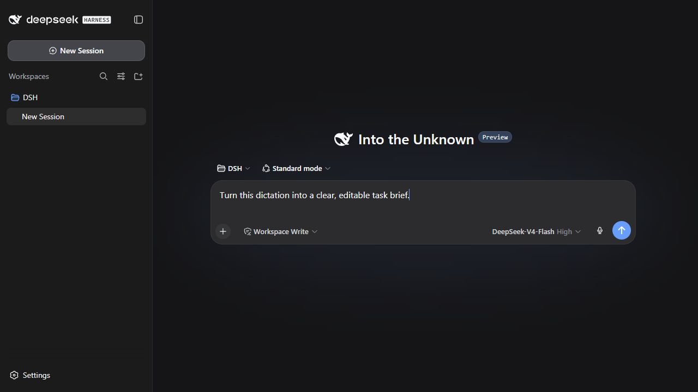
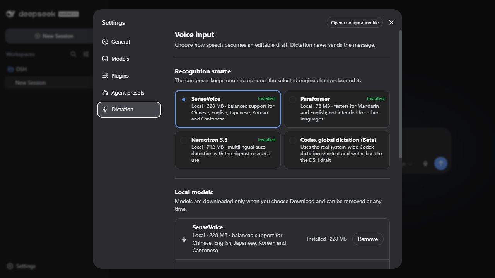

# DSH Dictation

Editable speech-to-text for the DeepSeek Harness composer.

[](https://github.com/WSL043/dsh-dictation/actions/workflows/ci.yml)
[](https://www.npmjs.com/package/dsh-dictation)
[](https://www.npmjs.com/package/dsh-dictation)
[](./LICENSE)

[简体中文](./README.md)



One microphone sits directly beside Send. Start speaking, review the editable transcript in the composer, then decide when to send it.

## Highlights

- Writes recognition results into the current draft and never submits automatically.
- Uses one consistent microphone for local recognition or Codex Desktop dictation.
- Starts or stops with the microphone or `Ctrl+Shift+D`; Escape cancels local capture without changing the draft.
- Keeps model downloads and source selection in a dedicated **Settings → Dictation** page.
- Downloads no speech model until the user asks for one; every local model can be removed independently.



## Recognition sources

| Source | Best fit | Boundary |
| --- | --- | --- |
| **SenseVoice Small** | Private local dictation in Mandarin, Cantonese, English, Japanese and Korean | Balanced default, about 228 MB. Noisy speech, punctuation and long-form accuracy can be lower than a desktop service. |
| **Paraformer Small** | Fast local Mandarin and English | Lightest option, about 78 MB. Other languages and dialect-heavy speech are outside its intended range. |
| **Nemotron 3.5 ASR** | Local multilingual recognition with automatic language detection | About 712 MB plus a native runtime. It uses the most memory and CPU of the local choices. |
| **Codex global dictation (Beta)** | Reusing an installed Codex Desktop dictation setup | Codex must be running with a global toggle shortcut configured. The plugin reads no Codex account data. |

## Install

Standard DSH command:

```sh
dsh plugin --profile web add dsh-dictation@0.1.0-beta.1
```

Save active work and restart DSH manually after installation.

## Update and uninstall

Run the installation command again with the desired version. To remove the plugin:

```sh
dsh plugin --profile web remove dsh-dictation
```

Downloaded local models are managed separately from **Settings → Dictation**.

## Privacy

- SenseVoice, Paraformer and Nemotron run locally after their model files are downloaded.
- Codex Desktop mode uses only the configured global dictation shortcut and does not read Codex credentials or account data.
- Dictation writes only to the editable DSH draft and never sends a message.

## Compatibility

Tested in the latest stable DeepSeek Harness release. Preview support is published only after separate acceptance.

## Feedback

[Report a problem](https://github.com/WSL043/dsh-dictation/issues/new/choose)

## License

MIT. See [LICENSE](./LICENSE) and [THIRD_PARTY_NOTICES.md](./THIRD_PARTY_NOTICES.md).
