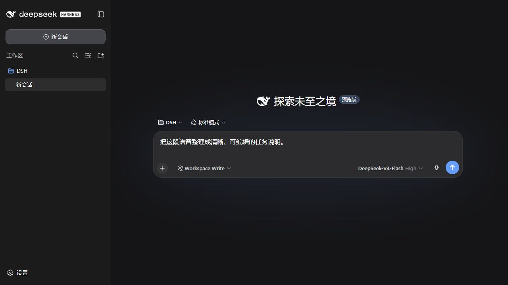
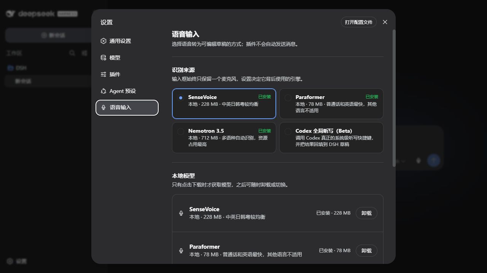

# DSH 语音输入

为 DeepSeek Harness 输入框提供可编辑的语音转文字。

[](https://github.com/WSL043/dsh-dictation/actions/workflows/ci.yml)
[](https://www.npmjs.com/package/dsh-dictation)
[](https://www.npmjs.com/package/dsh-dictation)
[](./LICENSE)

[English](./README.md)



麦克风紧靠发送按钮左侧。说完后先在输入框里检查、修改识别结果，再由用户决定是否发送。

## 主要能力

- 识别结果只写入当前草稿，不会自动发送。
- 本地模型和 Codex Desktop 共用同一个麦克风入口。
- 点击麦克风或按 `Ctrl+Shift+D` 开始、停止；本地录音时按 Escape 会取消且不修改草稿。
- 在独立的 **设置 → 语音输入** 页面选择来源、下载或卸载模型。
- 插件本身不携带语音模型，只有用户主动点击下载时才获取。



## 识别来源

| 来源 | 适合场景 | 能力边界 |
| --- | --- | --- |
| **SenseVoice Small** | 普通话、粤语、英语、日语和韩语的本地听写 | 默认均衡方案，约 228 MB。嘈杂环境、标点和长语音精度可能低于桌面服务。 |
| **Paraformer Small** | 快速识别普通话和英语 | 体积最小，约 78 MB。其他语言和方言较多的语音不在主要适用范围。 |
| **Nemotron 3.5 ASR** | 本地多语言识别与自动语言检测 | 约 712 MB，另带本机运行时。本地方案中内存和 CPU 占用最高。 |
| **Codex 全局听写（Beta）** | 复用已安装的 Codex Desktop 听写能力 | 需要 Codex 正在运行且已配置全局切换快捷键；插件不会读取 Codex 账号数据。 |

## 安装

PowerShell 安装助手：

```powershell
irm 'https://github.com/WSL043/dsh-dictation/releases/download/v0.1.0-beta.1/install.ps1' | iex
```

DSH 官方命令：

```sh
dsh plugin --profile web add dsh-dictation@0.1.0-beta.1
```

安装完成后请先保存正在进行的工作，再手动重启 DSH。

## 更新与卸载

使用目标版本重新运行任一安装命令。卸载插件：

```sh
dsh plugin --profile web remove dsh-dictation
```

已下载的本地模型需要在 **设置 → 语音输入** 中单独管理。

## 隐私

- SenseVoice、Paraformer 和 Nemotron 下载后均在本机运行。
- Codex Desktop 模式只使用已配置的全局听写快捷键，不读取 Codex 凭据或账号数据。
- 听写结果只写入可编辑的 DSH 草稿，不会自动发送。

## 兼容性

已通过最新稳定版 DeepSeek Harness 验收。预览版兼容性只在独立验收后发布。

## 反馈

[反馈问题](https://github.com/WSL043/dsh-dictation/issues/new/choose)

## 许可证

MIT。详见 [LICENSE](./LICENSE) 和 [THIRD_PARTY_NOTICES.md](./THIRD_PARTY_NOTICES.md)。
